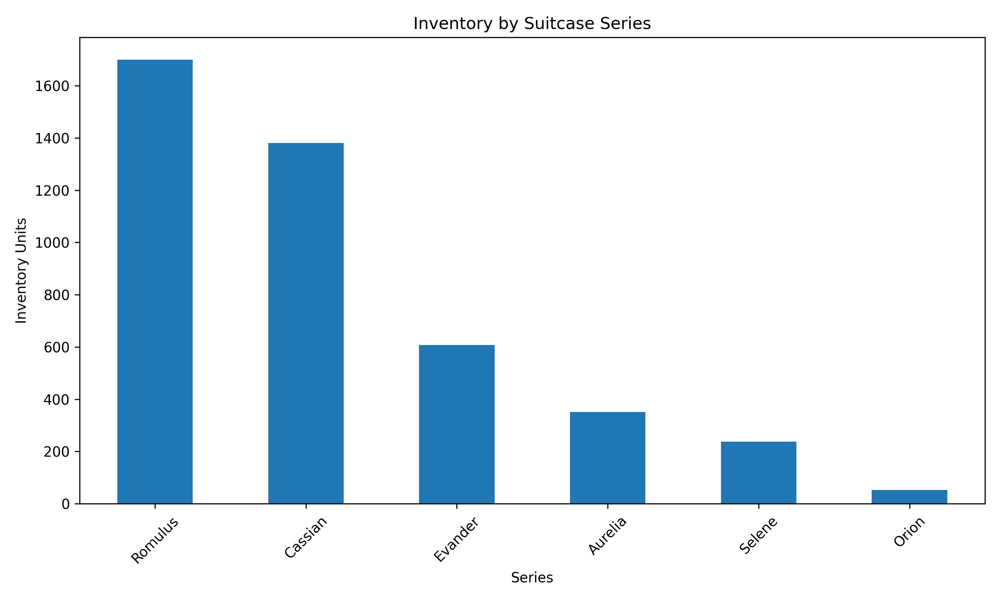
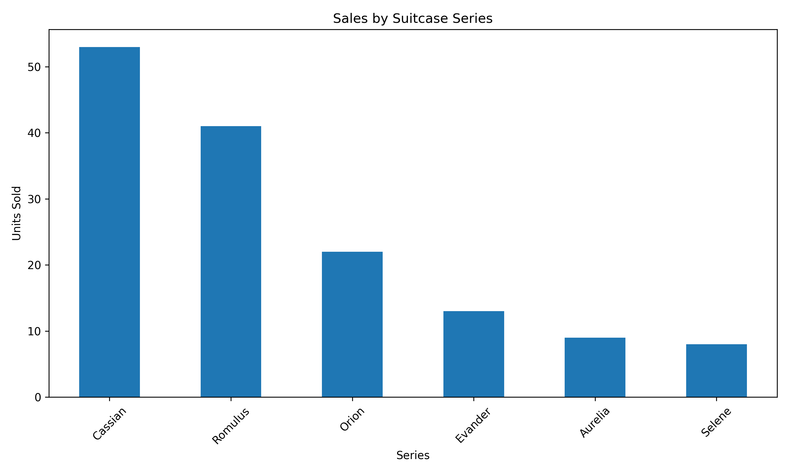
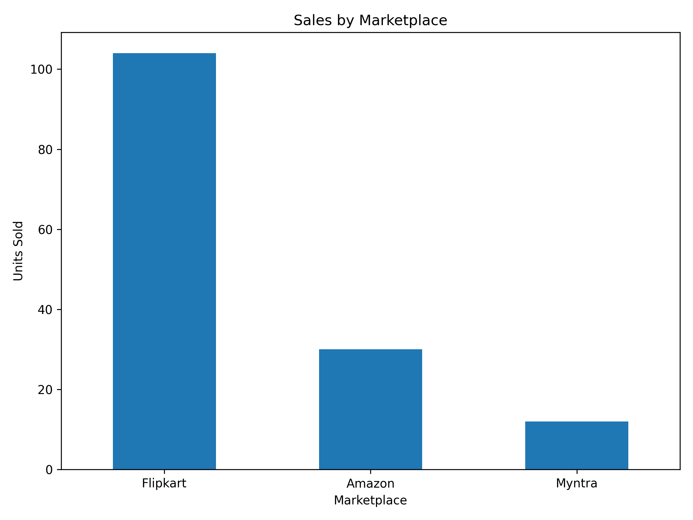
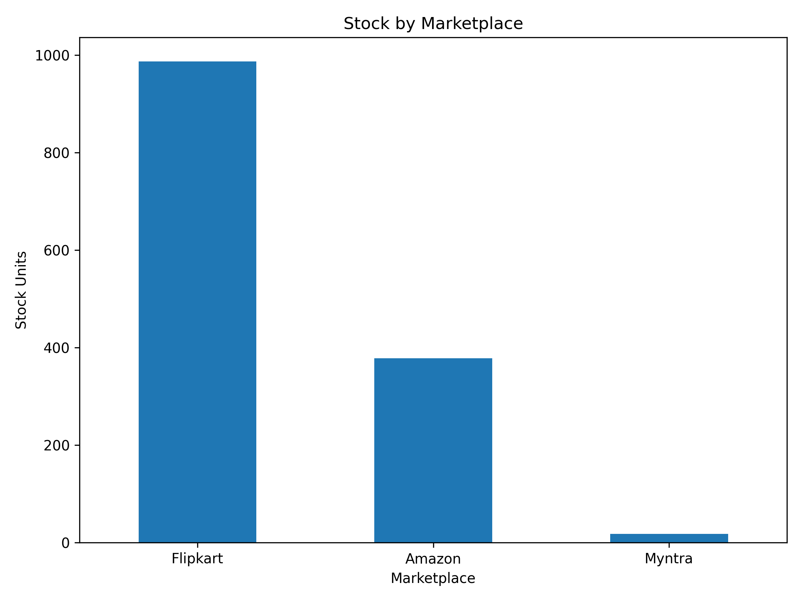

# Acer Portfolio Analysis

## Project Overview

This project analyzes Acer's suitcase portfolio using Excel, SQL, Python, and Power BI.

The analysis focuses on:

- Sales performance by suitcase series
- Inventory levels and stock risk
- Marketplace performance
- Sales-to-inventory efficiency
- Inventory value
- Business recommendations

The project follows a complete data-analysis workflow:

**Excel → SQL → Python → Power BI → Business Insights**

---

## Project Presentation

📊 **[View Internship Project Presentation](./Acer_Portfolio_Analysis_Presentation.pptx)**

The presentation provides an executive overview of the project, including the business problem, data workflow, analytical framework, key findings, recommendations, and project contribution.

## Project Highlights

| Metric | Result |
|---|---:|
| Product Records | 45 |
| Suitcase Series | 6 |
| Total Sales | 146 units |
| Total Inventory | 4,328 units |
| Inventory Value at MRP | ₹81.61M |
| Top Series by Sales | Cassian — 53 units |
| Top Marketplace | Flipkart — 104 units |

### Key Takeaways

- **Cassian** is the highest-selling series with **53 units sold**.
- **Cassian and Romulus** together contribute **64.38% of total sales**.
- **Flipkart** is the dominant marketplace, contributing **104 of 146 total sales**.
- **Orion** has the lowest inventory level at **52 units** and should be monitored for replenishment.
- **Romulus** has the highest inventory level at **1,700 units**, requiring inventory optimization.
- Marketplace stock is heavily concentrated in **Flipkart**.

---

## Tools & Technologies

| Tool | Purpose |
|---|---|
| Microsoft Excel | Data collection, organization, formulas, Pivot Tables and initial analysis |
| MySQL | Database creation, data modeling and SQL-based analysis |
| Python | Automated data analysis, calculations, CSV generation and visualization |
| Pandas | Data loading, transformation and aggregation |
| NumPy | Numerical calculations |
| Matplotlib | Data visualization |
| Power BI | Interactive dashboard and business insights |

---

## Dataset

The analysis uses Acer suitcase portfolio data containing:

- 6 suitcase series
- 45 product records
- Sales information
- Inventory information
- Marketplace-level sales
- Marketplace-level stock
- Inventory value at MRP

### Suitcase Series

- Orion
- Aurelia
- Cassian
- Romulus
- Evander
- Selene

---

## Excel Analysis

Excel was used as the initial data-analysis layer.

Key activities included:

- Organizing product and inventory data
- Calculating sales and inventory metrics
- Using formulas such as `SUMIF`, `SUMIFS`, and `COUNTIF`
- Creating Pivot Tables
- Comparing marketplace performance
- Preparing the dataset for SQL, Python, and Power BI analysis

---

## SQL Analysis

MySQL was used to create a structured analysis database.

The SQL implementation includes:

- Database and table creation
- Primary and foreign keys
- Data insertion
- `SELECT`
- `WHERE`
- `GROUP BY`
- `ORDER BY`
- Aggregate functions
- `CASE`
- `JOIN`
- `HAVING`
- Subqueries
- CTEs
- `UNION ALL`
- Window functions
- `RANK() OVER()`
- `PARTITION BY`
- Stock classification
- Series-level analysis
- Marketplace-level analysis

The SQL layer provides an independent validation of key sales, inventory, and marketplace metrics used in the dashboard.

---

## Python Analysis

Python was used to automate the analysis process.

The Python workflow:

1. Reads the Excel workbook using Pandas
2. Cleans column names
3. Calculates sales and inventory metrics
4. Calculates sales-to-inventory ratios
5. Analyzes marketplace performance
6. Classifies stock levels
7. Calculates inventory value
8. Identifies potential replenishment and excess-stock candidates
9. Exports analysis results to CSV
10. Generates charts using Matplotlib

### Python Outputs

The automated analysis generates:

- Sales by series
- Inventory by series
- Sales by marketplace
- Stock by marketplace
- Stock-risk analysis
- Series and marketplace charts

---

## Visual Analysis

### Inventory by Suitcase Series



### Sales by Suitcase Series



### Sales by Marketplace



### Stock by Marketplace



---

## Power BI Dashboard

Power BI was used to convert the analyzed data into an interactive business dashboard.

The dashboard provides:

- Sales performance
- Inventory status
- Marketplace performance
- Stock-risk analysis
- Business recommendations

The dashboard enables users to evaluate the portfolio from both sales and inventory perspectives.

---

## Key Findings

### Sales Performance

- **Cassian** is the best-selling series with **53 units sold**.
- **Romulus** follows with **41 units sold**.
- Together, Cassian and Romulus contribute **64.38% of total sales**.

### Inventory Status

- **Romulus** has the highest inventory with **1,700 units**.
- **Cassian** follows with **1,380 units**.
- **Orion** has the lowest inventory with **52 units**.

### Marketplace Performance

- **Flipkart** is the leading marketplace with **104 units sold**.
- **Amazon** contributes **30 units**.
- **Myntra** contributes **12 units**.
- Flipkart accounts for approximately **71% of total sales**.

### Inventory Risk

- Orion has the lowest inventory level at **52 units** and should be monitored for replenishment.
- Romulus has the highest inventory at **1,700 units**, requiring inventory monitoring.
- Marketplace stock is heavily concentrated in Flipkart.

### Overall Portfolio

- **Total Sales:** 146 units
- **Total Inventory:** 4,328 units
- **Inventory Value at MRP:** ₹81,608,672

---

## Business Recommendations

1. **Prioritize replenishment of Orion** due to its low inventory level.
2. **Monitor Romulus inventory** because it holds the largest stock level.
3. Review lower-sales series with relatively high inventory for possible inventory optimization.
4. Continue monitoring **Flipkart**, which is the dominant marketplace for both sales and stock.
5. Use sales-to-inventory ratios to identify products requiring replenishment or inventory optimization.

---

## How to Run

### Python Analysis

Install the required libraries:

```bash
pip install pandas numpy matplotlib openpyxl
